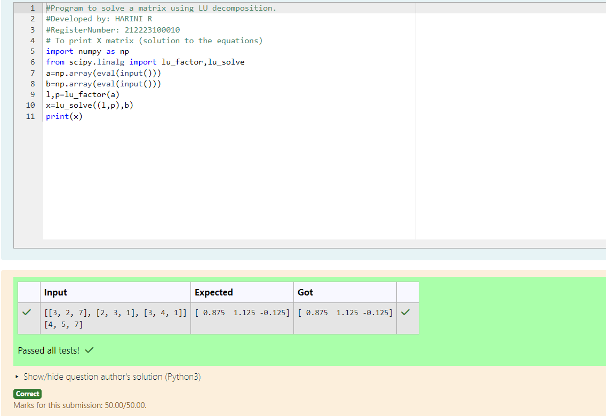

# EX05 LU Decomposition 

## AIM:
To write a program to find the LU Decomposition of a matrix.

## Equipments Required:
1. Hardware – PCs
2. Anaconda – Python 3.7 Installation / Moodle-Code Runner

## Algorithm
1. Import numpy extension and scipy.linalg extension
2. Initialize the matix values
3. Use lu functions from imported extensions
4. Print the output

## Program:
(i) To find the L and U matrix
```
#Program to find L and U matrix using LU decomposition.
#Developed by: HARINI R
#RegisterNumber: 212223100010
import numpy as np
from scipy.linalg import lu
a=np.array(eval(input()))
p,l,u=lu(a)
print(l)
print(u)
```
(ii) To find the LU Decomposition of a matrix
```
#Program to solve a matrix using LU decomposition.
#Developed by: HARINI R
#RegisterNumber: 212223100010
# To print X matrix (solution to the equations)
import numpy as np
from scipy.linalg import lu_factor,lu_solve
a=np.array(eval(input()))
b=np.array(eval(input()))
l,p=lu_factor(a)
x=lu_solve((l,p),b)
print(x)
```

## Output:
(i) To find the L and U matrix


(ii) To find the LU Decomposition of a matrix


## Result:
Thus the program to find the LU Decomposition of a matrix is written and verified using python programming.

